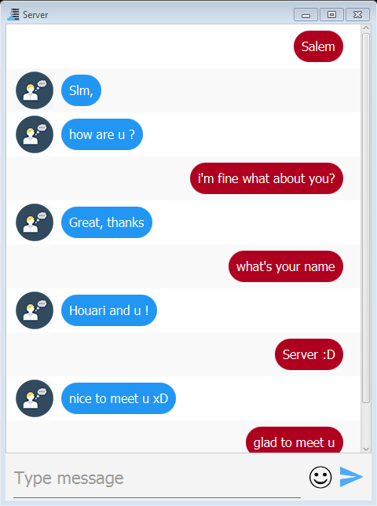
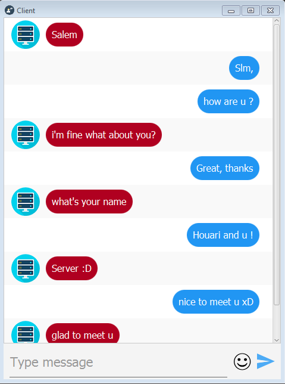

# ChatFx
Desktop application :computer: that allow you to make a live chat.

## Features :heavy_check_mark:
* Very simple to use.
* One-on-one messaging.
* <del>Send pictures</del> (soon).

## Screenshots

Home                            |
:-------------------------------:
|

Client                     |  Server
:-------------------------:|:-------------------------:
  |  

## Libraries used
* JFoenix (Material Design).
* FontAwesomeFx (icons).

## Technologies used
* JavaFX.
* Socket.

## Requirements
* Java version 8 or later.
* Maven.
* IDE like Intellij IDEA or other.

## Contributing 💡
If you want to contribute to this project and make it better with new ideas, your pull request is very welcomed.
If you find any issue just put it in the repository issue section, thank you.

## Follow me 🎯
<a href="https://www.facebook.com/ZegaiBlog">Facebook</a> | <a href="https://www.youtube.com/HouariZegai">Youtube</a> | <a href="https://www.twitter.com/HouariZegai">Twitter</a> | <a href="https://www.instagram.com/HouariZegai">Instagram</a>

.سبحَانَكَ اللَّهُمَّ وَبِحَمْدِكَ، أَشْهَدُ أَنْ لا إِلهَ إِلأَ انْتَ أَسْتَغْفِرُكَ وَأَتْوبُ إِلَيْكَ